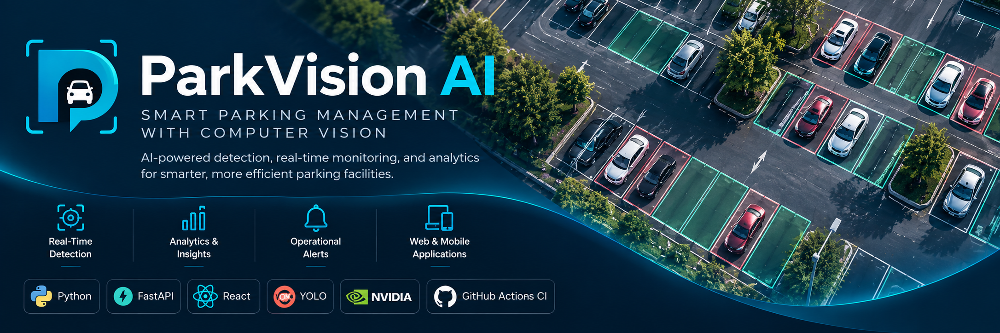
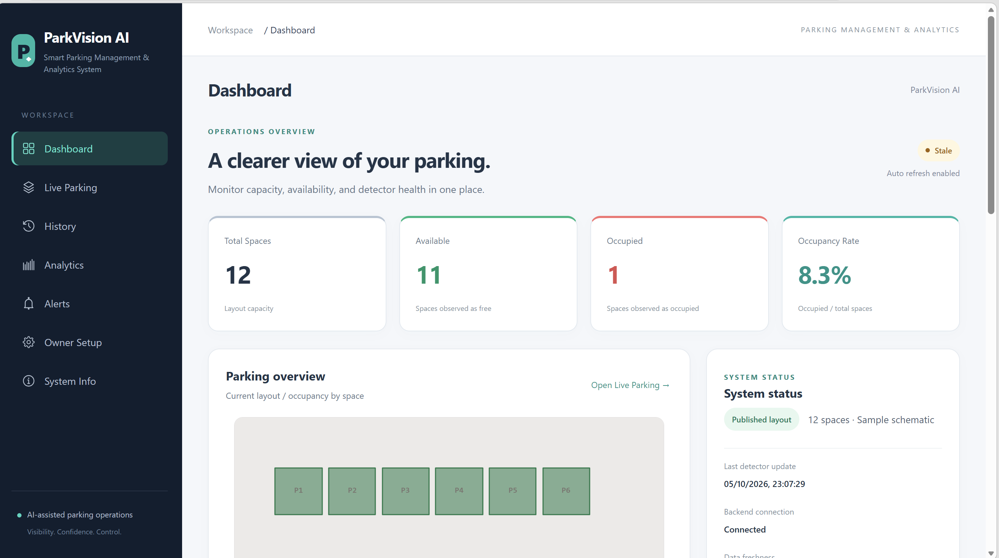
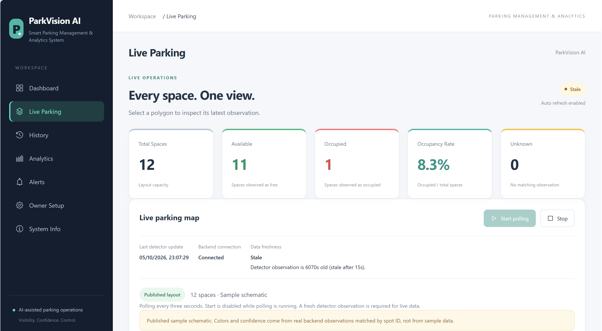
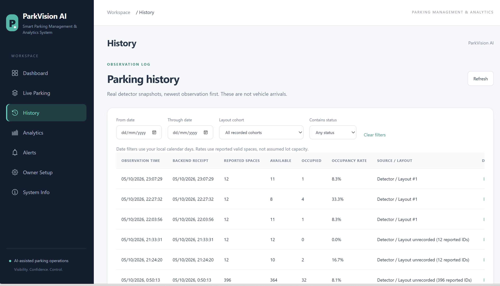
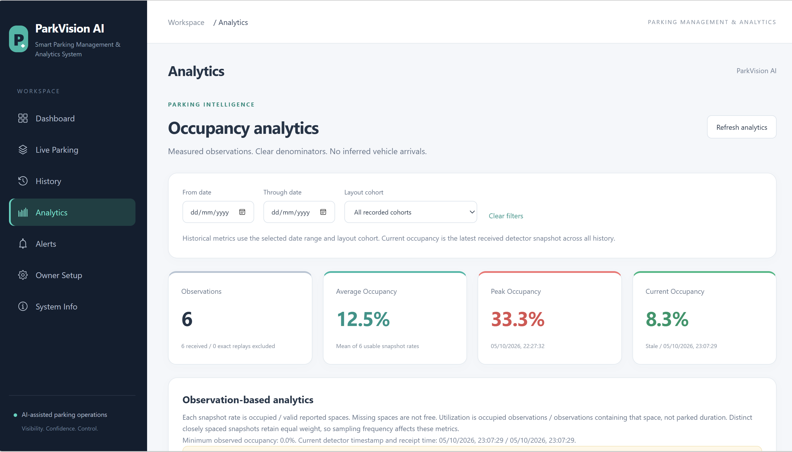
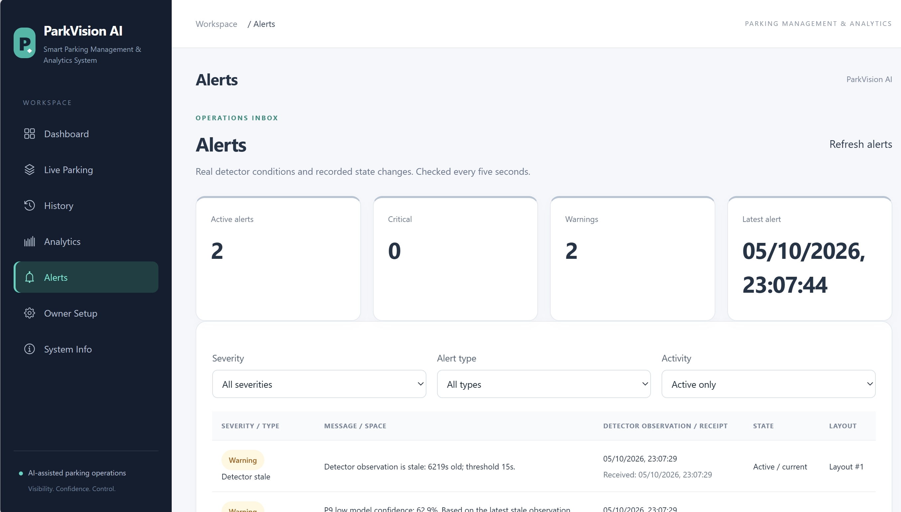
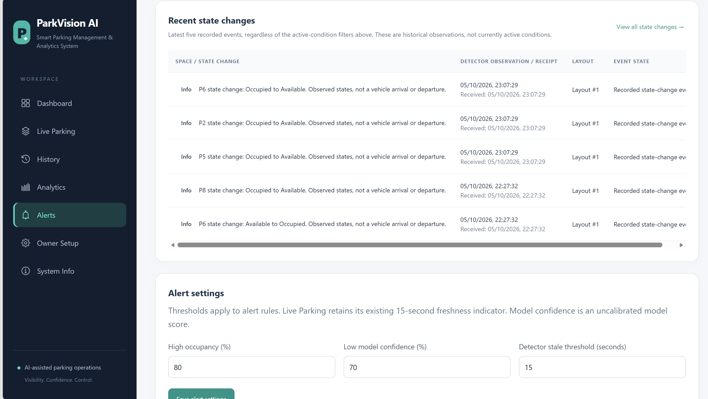

# ParkVision AI

**Smart Parking Management & Analytics System**

    [](https://github.com/amnaabdul/ParkVision-AI/actions/workflows/ci.yml) [](LICENSE.md)

ParkVision AI integrates an existing computer-vision occupancy pipeline with a
management dashboard, persistent history, observation-based analytics, and
operational alerts using FastAPI, SQLite, and React/Vite. The team's implemented
work focuses on the management interface and related data, API, usability,
testing, and documentation extensions; existing models and datasets are used
without a claim of original authorship.

## Team Members

- Amna Jabarin
- Mohammad Ziyadat
- Fihmi Sbeih

## 1. Introduction

Parking managers need to understand availability and changes over time, rather
than rely only on a single camera image. ParkVision AI connects computer-vision
occupancy observations with a management dashboard, history, observation-based
analytics, and operational alerts to support that visibility.

## 2. System Description

The workflow is camera/image -> edge AI detector -> FastAPI backend -> SQLite
persistence -> React management dashboard. The areas below expose reported space
states and their context. Observations and state changes are not automatically
interpreted as vehicle movements or arrivals/departures.

### Current features

- Dashboard: capacity, availability, occupancy, freshness, recent trend, and alerts.
- Live Parking: real polygon map, Start/Stop polling, keyboard space selection,
  status, model confidence, and observation time.
- Owner Setup: owner token controls, photo upload, SfM layout generation, explicit
  sample handoff publishing, layout preview, and label corrections.
- History: newest-first detector snapshots, date/layout/status filters and
  expandable per-space observations.
- Analytics: occupancy trends and per-space observation-based utilization.
- Alerts: high occupancy, low model confidence, stale data, browser-observed
  backend outage, and separately labeled recorded state-change events.
- System Info: architecture and data semantics.
- Existing mobile Live Occupancy and Find My Car APIs remain supported.

## Architecture

```text
Camera / Image -> Edge AI Detector -> FastAPI -> SQLite -> Management Dashboard
```

The canonical detector path loads parking-space quadrilaterals, perspective-warps
patches, applies YOLOv8 classification and temporal smoothing, then posts JSON to
`POST /update`. The backend stores snapshots in `log` and captures the active
layout in `detector_context`. The browser polls `GET /status` every three seconds
while enabled; management views consume additive `/analytics/*` and `/alerts`
APIs. Legacy `/history`, `/sessions`, and mobile routes remain compatible.

A recorded layout identifies the backend's active layout at receipt time, not
proof that edge camera geometry is correct. A published sample schematic matches
spot IDs but is not a surveyed camera layout. Match real camera polygons to the
actual image before interpreting real-world coverage.

## 3. Implementation

The Python edge pipeline uses Ultralytics YOLO with the project's existing model
weights. FastAPI handles observation ingestion and layout APIs, SQLite stores
snapshots and settings, and React/Vite provides the management interface. The
following technical sections describe the existing implementation without claiming
ownership of existing models, datasets, or all ML components.

### Technology stack and structure

Python, Ultralytics YOLO, OpenCV, FastAPI, SQLite; React, Vite, Leaflet and CSS;
existing React Native / Expo mobile app. No fabricated data drives the dashboard.

```text
backend/       API, SQLite, analytics.py, alerts.py
edge/          detector and configuration (unchanged inference)
frontend/src/  pages, components, hooks, API client
frontend/mobile/  existing mobile app
ml/            training, SfM, evaluation, export, localization
samples/live_occupancy/  existing sample images
scripts/       development checks and existing smoke/ML helpers
tests/         backend, edge, and ML tests
docs/          architecture, runbooks, DEMO_GUIDE.md
```

## Windows setup

Run from the repository root. Use a supported current Python runtime compatible
with `requirements.txt` and Node.js **22.12+** (or supported Node 20.19+) for Vite 8.
The Python environment used for local checks can be inspected with `python --version`.

```powershell
py -m venv .venv
.\.venv\Scripts\Activate.ps1
pip install -r requirements.txt
```

Some optional export packages, particularly Core ML, are platform-dependent.
Runtime dependency compatibility depends on your Python/platform. No model
training or download occurs at startup. Existing trained weights are expected at
`acpds_cls/weights/best.pt`; see the model-fetch instructions and
[MODEL_LICENSE.md](MODEL_LICENSE.md). Weights are excluded from git; existing
GitHub Release assets can be fetched with `make fetch-weights` or
`bash scripts/fetch_weights.sh` in a Bash-capable environment. Check paths without altering data:

```powershell
.\scripts\start-dev.ps1
```

This helper checks prerequisites and prints commands; it does not install or
launch background processes. If PowerShell blocks activation, use
`.\.venv\Scripts\python.exe` directly. Use `npm.cmd` if `npm.ps1` is blocked.

### Backend (terminal 1, repository root)

```powershell
.\.venv\Scripts\Activate.ps1
python -m uvicorn backend.main:app --host 0.0.0.0 --port 8000
```

API documentation: `http://localhost:8000/docs`; health: `/health`. The existing
SQLite file is `parking.db` in the repository root; never delete it to reset a presentation.

### Frontend (terminal 2)

```powershell
cd frontend
npm install
npm run dev
```

Open the URL Vite prints (normally `http://localhost:5173`; it may choose another
port if occupied). Optionally copy `frontend/.env.example` to `.env.local` and set
`VITE_API_BASE`; restart Vite after changes. The default backend is
`http://localhost:8000`. To keep the demo port fixed, use
`npm run dev -- --port 5173 --strictPort`.

### Layout publishing

Inspect the currently loaded layout in Owner Setup first. Keep an existing
compatible published layout when demonstrating consecutive observations.
Loading **sample handoff** is an explicit preview; it creates no detector data.
Correct labels, then choose **Publish layout / Use for Live Parking** only when
you intend to replace the active map. Publishing verifies the backend map and
opens Live Parking with polling paused. Choose **Start polling**. Do not
republish between observations for a same-layout state-change demonstration:
each publication creates a new recorded layout identity.

Alternatively upload overlapping photos and run SfM to generate a layout.
Generation depends on photo overlap and COLMAP availability. `POST /map` remains
available for supplied real parking polygons. Sample geometry is identified as
schematic, even after publishing; occupancy is always actual backend data.

### Detector (terminal 3, repository root, activated environment)

The following sample exists in this repository:

```powershell
python edge\detect.py --image "samples\live_occupancy\frame_05_GOPR0090.JPG" --post
```

For a portable Windows CPU run, explicitly override the existing config's `mps`
device setting:

```powershell
python edge\detect.py --image "samples\live_occupancy\frame_04_GOPR0089.JPG" --device cpu --post
python edge\detect.py --image "samples\live_occupancy\frame_05_GOPR0090.JPG" --device cpu --post
```

Run these separately while displaying the new observations. Check the detector's
output and successful posting; predictions vary with model, geometry, and config.
The classifier checkpoint defaults to `acpds_cls/weights/best.pt`; override with
`--stage2-model`. The detector's `--backend-url` defaults to the complete URL
`http://127.0.0.1:8000/update`, unlike the frontend's base URL. See
[edge/README.md](edge/README.md). These commands write real observations and logs.

## Management data and quality

- History exposes real detector snapshots and per-space statuses, not a vehicle
  arrival ledger. Existing `park_sessions` rows include snapshots and Find My Car
  sessions; repeated rows do not represent separate vehicle arrivals.
- Analytics deduplicate exact replays using timestamp, cohort and reported data.
  Distinct closely spaced observations remain distinct. Mean occupancy is the
  arithmetic mean of valid snapshot percentages; per-space utilization is
  occupied reported observations / all reported observations for that space.
  It is **observation-based**, not duration-based. Missing spaces are not free.
- Dashboard/Live capacity occupancy uses occupied / layout capacity; analytics
  and high-occupancy alerts use occupied / valid reported spaces. Unknown layout
  spaces are visible and never silently counted as available.
- Detector UTC timestamps are parsed as instants; display uses browser local time.
  Receipt/poll time is separate. Live freshness is stale after **15 seconds**;
  a connected backend can hold stale observations. Invalid/future timestamps have
  unknown freshness. Stopping polling retains last known data.
- Confidence is a model score, not a calibrated probability. Missing confidence
  is not invented. Legacy layout identities remain explicitly unrecorded; cohort
  filters let you avoid combining unlike layouts.

### Alerts and configuration

`GET /alerts`, `GET /alerts/settings`, `PUT /alerts/settings` are additive APIs.
Use the Alerts page to persist validated settings in SQLite:

| Rule | Default trigger | Severity |
| --- | --- | --- |
| High occupancy | Occupied / valid reported spaces x 100 >= 80% | Critical |
| Low model confidence | Actual score x 100 < 70% | Warning |
| Detector stale | Elapsed detector age > 15 seconds | Warning |
| Backend unavailable | Failed browser health probe after alerts failure | Critical |
| State change | Changed common-space status in consecutive compatible snapshots | Info |

Occupancy is configurable 1-100%, confidence 0-100%, stale seconds >0. Alert stale
settings apply to alerts only; Live Parking keeps its existing 15-second indicator.
Alert reads are deterministic, not a growing persisted incident feed. Historical
conditions are recomputed under current settings. Recent state changes are visible
separately from **Active only**; **View all state changes** opens recorded events.
Only identical recorded layout IDs with valid increasing observation timestamps
are compared; uncertain legacy layouts and unmapped spot cohorts are skipped.
No vehicle arrivals/departures are inferred. Backend outage is browser-local and
cannot distinguish server failure from network reachability. Cached alerts are
unverified during errors. Alerts recheck every five seconds; they do not restart
Live Parking polling.

| Setting | Configuration |
| --- | --- |
| Web backend URL | `frontend/.env.local`: `VITE_API_BASE=http://localhost:8000` |
| Backend auth | Set `$env:AUTH_ENABLED="1"` before starting FastAPI |
| Owner token | Owner Setup registers a username and stores token locally; existing bearer-token scheme |
| Detector model/device | `edge/config.yaml`, or `--stage2-model` / `--device cpu` |
| Detector posting URL | `--backend-url http://127.0.0.1:8000/update` |
| Alert thresholds | Alerts settings panel / `PUT /alerts/settings`, persisted in SQLite |
| Ports | Backend 8000, web 5173, existing Expo normally 8081 |

FastAPI does **not** automatically load a root `.env`; root `.env.example` is
reference documentation. Set backend variables in the launching shell. Never put
bearer tokens in frontend `VITE_*` variables or commit real secrets. Optional auth
is a development-oriented existing mechanism, not production identity management;
the detector `/update` contract remains unchanged.

## Verification

```powershell
python -m pytest tests/test_backend.py tests/test_analytics.py tests/test_alerts.py
python -m pytest
python -m ruff check backend
cd frontend
npm test
npm run lint
npm run build
```

The first command runs all backend tests; the second also runs edge/ML tests,
which may require additional platform/dependency support. Follow
[docs/DEMO_GUIDE.md](docs/DEMO_GUIDE.md) for a safe presentation sequence.

## 4. Demo

Follow [the demo guide](docs/DEMO_GUIDE.md) for startup commands and a reproducible
presentation. Start FastAPI and the frontend, retain one compatible published
layout, and post real inference from the existing images
[`frame_04_GOPR0089.JPG`](samples/live_occupancy/frame_04_GOPR0089.JPG) and
[`frame_05_GOPR0090.JPG`](samples/live_occupancy/frame_05_GOPR0090.JPG) using the
detector commands above. Do not republish the layout between observations.

Show Dashboard capacity and connection/freshness, Live Parking colors and space
confidence, the new History rows, real Analytics trends, and Alerts with recorded
state changes distinguished from active conditions. Single-image observations
become stale while the detector is idle. Predictions depend on actual weights,
configuration, and geometry; no fixed outputs or random occupancy are supplied.

Existing [Owner Setup](outputs/figures/ui_owner_setup_layout.png) and
[web occupancy map](outputs/figures/ui_web_map.png) screenshots illustrate the
earlier/base interface, distinct from the ParkVision AI management screenshots below.

### Management Dashboard Demo

These screenshots show the implemented ParkVision AI management interface using
real stored detector observations from the project demo workflow. They demonstrate
the working system and end-to-end management workflow, not model accuracy.

#### Dashboard



ParkVision AI management dashboard showing the latest parking occupancy summary, system status, and operational overview.

#### Live Parking



Live Parking view showing the published parking layout and the latest detector observation.

#### History



Historical detector observations with occupancy statistics, source information, and layout context.

#### Analytics



Observation-based analytics showing average, peak, and current occupancy metrics.

#### Alerts



Operational alerts derived from detector observations and configured thresholds.

#### Recent State Changes



Recorded state changes between compatible observations. These represent observed state transitions, not inferred vehicle arrivals or departures.

## Known limitations

Single-image inference produces one observation, which becomes stale if the
camera/detector is not continuously running. Sparse history cannot establish
continuous utilization, parking duration, traffic volume, or calibrated confidence.
Layout context is captured at backend receipt; do not change layouts mid-pair.
SfM needs compatible photos and external COLMAP tooling. Browser-local outage
alerts are not persisted, and no external notifications or acknowledgement flow
is implemented. Analytics/alerts scan stored snapshots; large archives may need
incremental aggregation. The current sample handoff is schematic, not calibrated
camera geometry. No synthetic history or metrics are supplied when offline.

## 5. Conclusions

The completed system demonstrates a path from image-based occupancy observations
to persistent history and a management interface. Combining current status with
observation-based analytics and alerts makes detector output easier to inspect
without equating snapshots with vehicle events.

Sparse observations, schematic sample geometry, uncalibrated confidence, and
browser-local outage detection limit what can be concluded. This course project
is not a claim of production deployment readiness. Reasonable future work includes
validating camera-specific geometry, collecting longer real observation sequences,
evaluating confidence calibration, incremental aggregation, and notification
delivery with explicit incident semantics.

## Project contribution scope

Amna Jabarin, Mohammad Ziyadat, and Fihmi Sbeih implemented the ParkVision AI management
experience, observation history, analytics, operational alerts and settings,
recorded-event presentation, and related API, testing, usability, and documentation
extensions. The system integrates existing edge detection, layout, persistence,
and mobile functionality. Existing datasets, model weights, and pre-existing
components are not presented as authored or trained by the course team.

Detailed technical references: [architecture](docs/architecture.md) and
[backend API documentation](backend/README.md).

## Reproducing the ML pipeline

The existing ML workflow includes the following preparation, training, evaluation,
and export commands. They are reference instructions, not a claim of new team
experiments or established deployment readiness.

```bash
# 1. Extract perspective-warped patches + validate
make prepare-stage2 ACPDS_ROOT=/path/to/acpds PREP_STAGE2_ARGS="--run-validation"
make validate-stage2 ACPDS_ROOT=/path/to/acpds VALIDATE_STAGE2_ARGS="--validation-status passed"

# 2. Train, evaluate, export
make train-stage2 STAGE2_VARIANT=n
make evaluate-stage2
make week6-export          # ONNX FP32 / INT8 + Core ML INT8

# 3. Generate a sample BEV layout, run SIFT localization
make layout-sample
make localize-car LOCALIZE_ARGS="--query samples/query.jpg --references samples/localization_refs --output logs/localize_result.json"
```

Direct CLI equivalents and expected outputs are documented in [`docs/`](docs/) and inline in the `ml/` scripts.

---

## Testing

```bash
make test                  # backend + edge + ML (pytest)
cd frontend && npm test    # web + mobile contract tests (Vitest)
make smoke-test            # end-to-end PRD path, in-process, in-memory DB
```

---

## Documentation

- [`docs/architecture.md`](docs/architecture.md) — canonical architecture reference
- [`docs/prd-diagrams.md`](docs/prd-diagrams.md) — architecture and comparison diagrams
- [`edge/README.md`](edge/README.md) — edge pipeline
- [`backend/README.md`](backend/README.md) — full API reference and schema
- [`frontend/README.md`](frontend/README.md) — web + mobile apps
- [`ml/README.md`](ml/README.md) — ML pipeline (extract → train → evaluate → export)

---

## Dataset

This project centers on **ACPDS** (Action-Centric Parking Dataset for Occupancy):

- 293 full parking-lot images captured at ~12 m height
- 11,236 parking-space annotations as quadrilateral polygons
- unique parking lots across train / val / test splits — true generalization by design
- ~48% occupied / 52% free — near-balanced
- MIT licensed

ACPDS is not redistributed in this repository; download it from the [dataset source](https://github.com/martin-marek/parking-space-occupancy) (paper: [arXiv:2107.12207](https://arxiv.org/abs/2107.12207)).

---

## Publishing policy

To keep the public tree safe to share:

- code, configs, metrics, and reproducible commands stay in the repo;
- trained weights are **not** committed to git history (publish as release assets after checking redistribution terms);
- dataset archives, extracted datasets, runtime databases, and generated logs stay out of git.

See [`MODEL_LICENSE.md`](MODEL_LICENSE.md) for model-weight and dataset redistribution guidance.

---

## Contributing

Issues and pull requests are welcome. Before opening a PR:

1. Run `make test` and `cd frontend && npm test` — both should be green.
2. Run `make lint` (Python) and `npm run lint` (frontend).
3. Keep changes aligned with [`docs/architecture.md`](docs/architecture.md); call out any mismatch rather than silently changing scope.

See [`CONTRIBUTING.md`](CONTRIBUTING.md) for the full contributor guide.

---

## License

The source code in this repository is released under the MIT License — see [`LICENSE.md`](LICENSE.md). Model weights and datasets carry separate redistribution terms — see [`MODEL_LICENSE.md`](MODEL_LICENSE.md).

---
